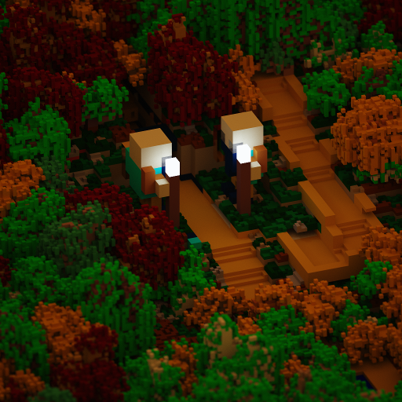

# ☼Vox Uristi☼

    

Export your Dwarf Fortress map in a voxel format to create beautiful
rendering of your fortresses.

|                   |
|---------------------------------------------------|
| *The gates of Arelumid and its two giant statues* |

Vox Uristi uses [DFHack's
RemoteFortressReader](https://docs.dfhack.org/en/stable/docs/tools/RemoteFortressReader.html)
to read the fortress data and export is in the `.vox` format. The resulting file
can then be opened in a software such as MagicaVoxel to render it.

## How to

Ensure you have [Dwarf
Fortress](https://store.steampowered.com/app/975370/Dwarf_Fortress/) and
[DFHack](https://store.steampowered.com/app/2346660/DFHack__Dwarf_Fortress_Modding_Engine/)
installed.

Run Vox Uristi, and select the upper and lower bound to export. Only the zone
between these two altitudes will be included in the exported model. It works
best by selecting the surface area of your map.

Once exported, open the `.vox` file with [MagicaVoxel](https://ephtracy.github.io/).
