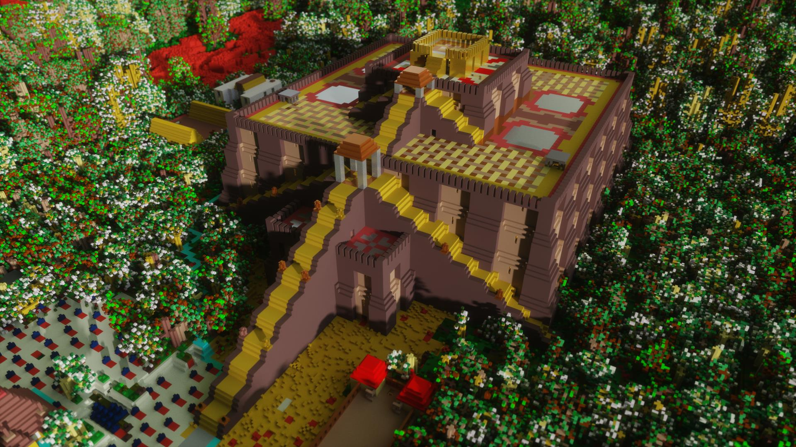

# ☼Vox Uristi☼

Export your Dwarf Fortress map in a voxel format to create beautiful
3D rendering of your fortresses.

|  |
| ------------------------------------------------- |
| *The ziggurat of Ikûl Tikis*                      |

Head to [the website](https://plule.github.io/vox-uristi/) to use it.

## Development

You need to have cargo installed, see [Installing
Rust](https://www.rust-lang.org/learn/get-started).

Vox Uristi is built and run using standard rust commands: `cargo build`, `cargo
run`.

### Optional Features

| Feature       | Description                  | Default  |
| ------------- | ---------------------------- | -------- |
| `gui`         | Graphical user interface     | enabled  |
| `self-update` | Ability to check for updates | enabled  |
| `dev`         | Development tools            | disabled |

## Release

1. Update `Cargo.toml` to the target release `<version>` and commit
2. `git tag v<version>`
3. `git push --tags`
