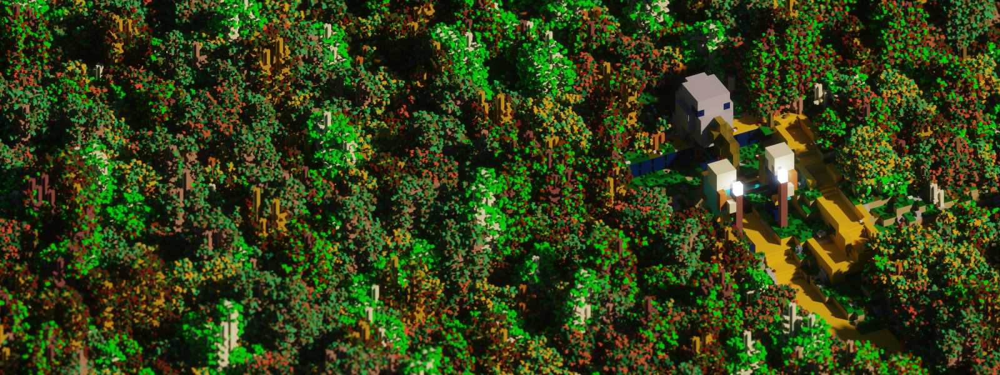
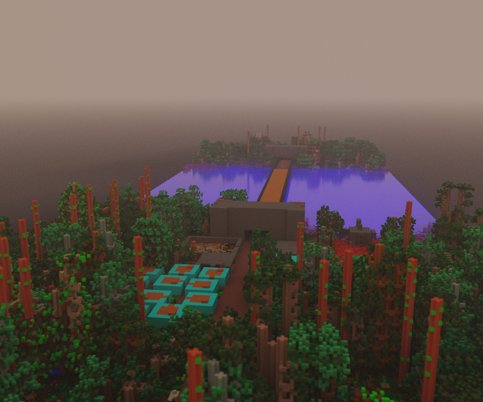
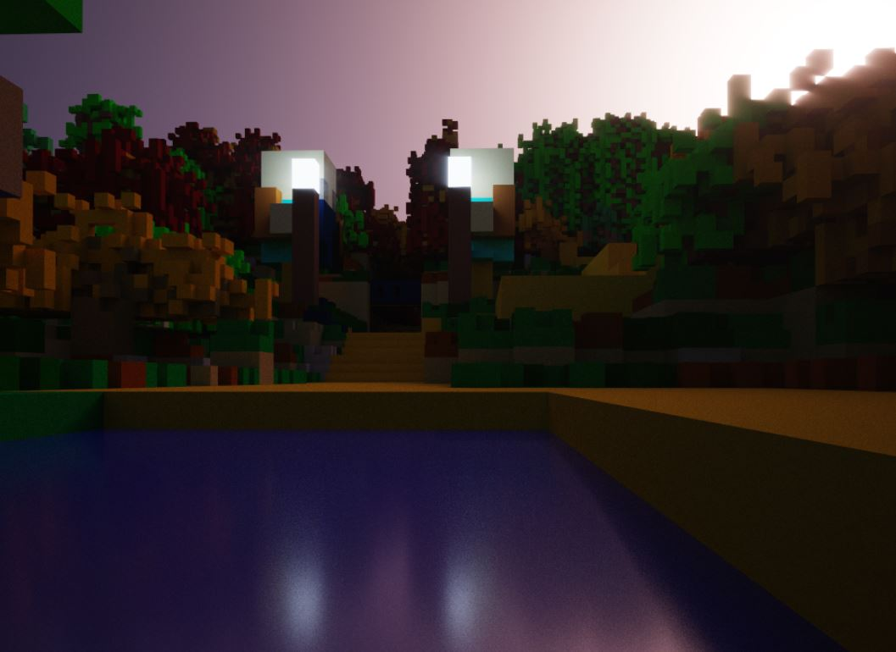
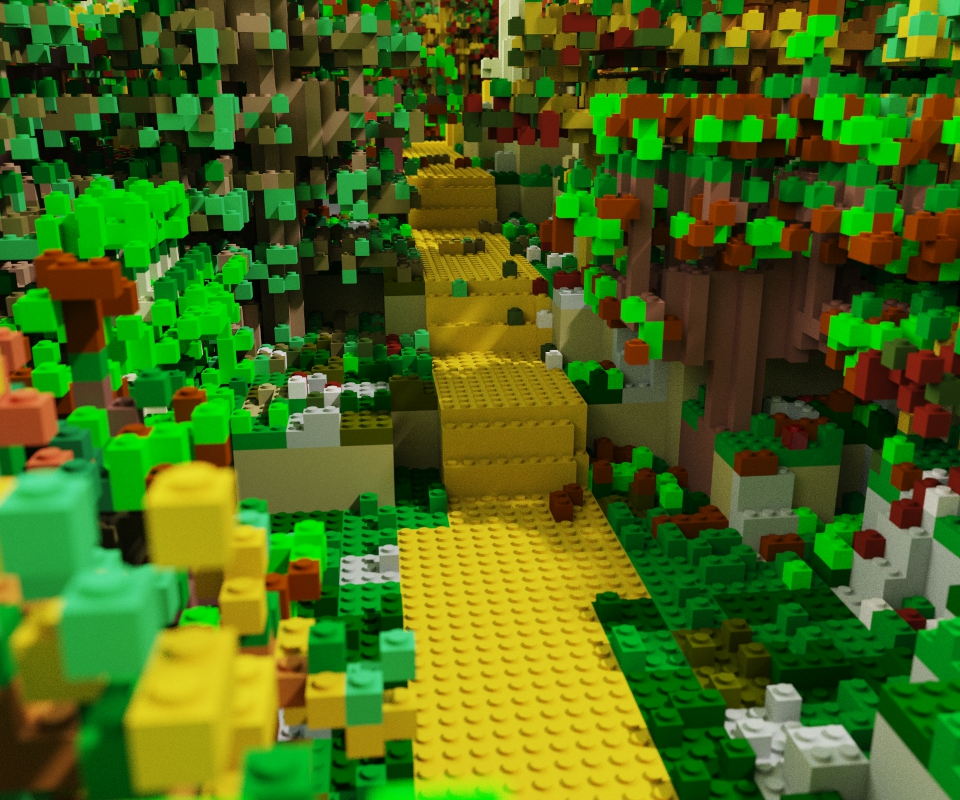
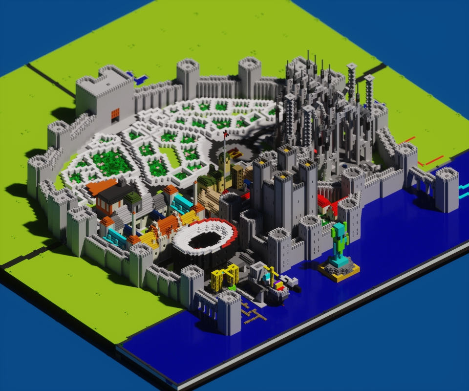
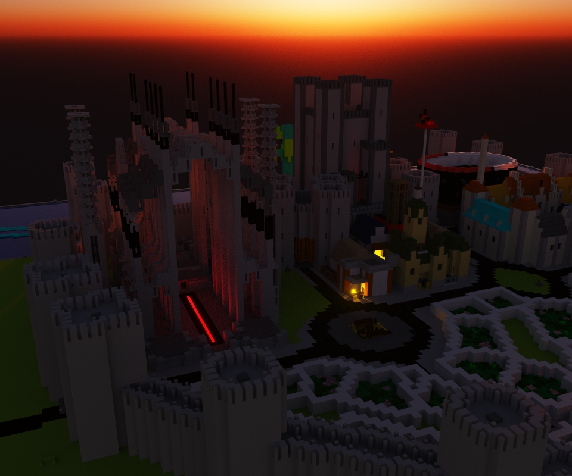
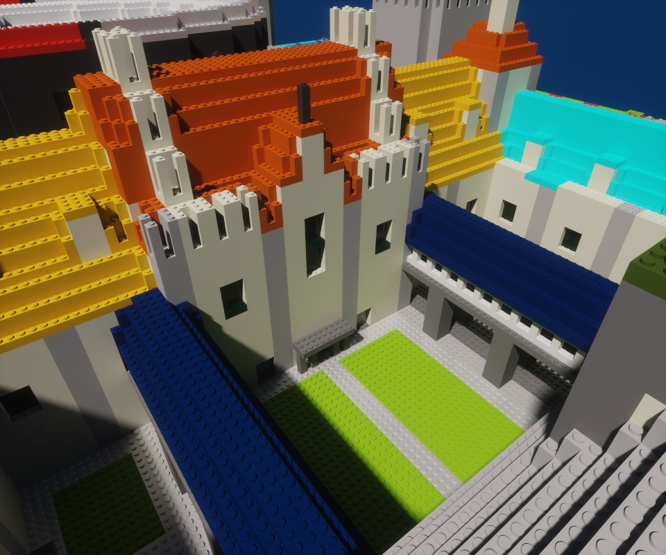
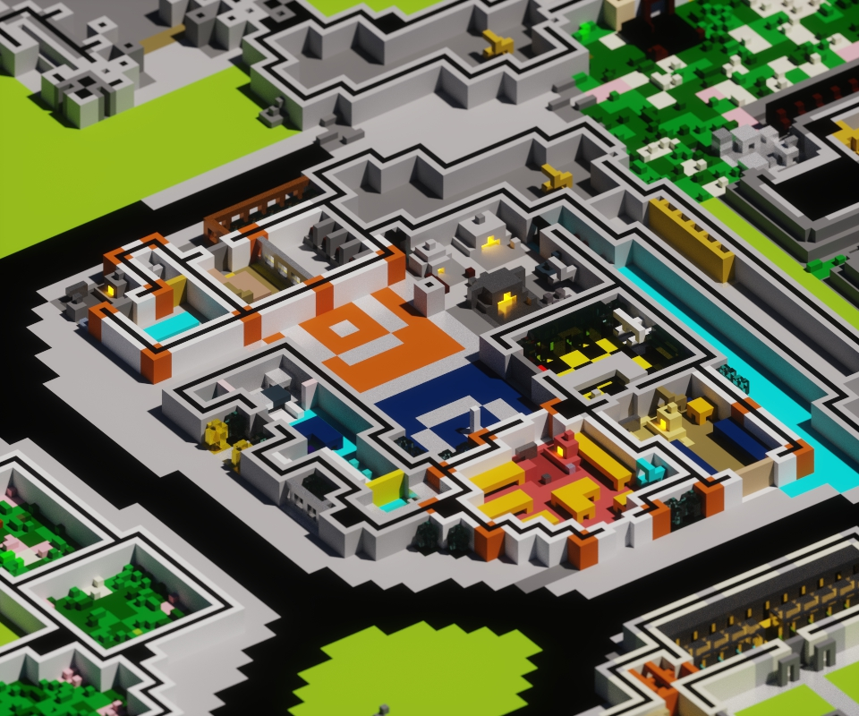
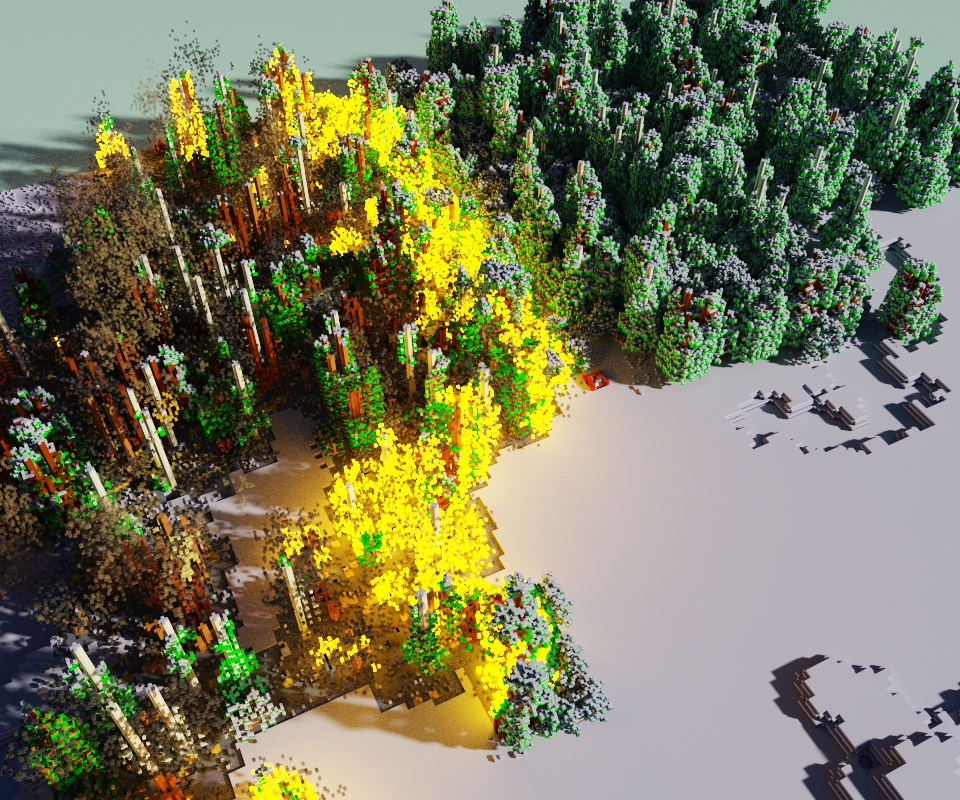

# ☼Vox Uristi☼

Export your Dwarf Fortress map in a voxel format to create beautiful rendering
of your fortresses.

**Vox Uristi** uses [DFHack's
RemoteFortressReader](https://docs.dfhack.org/en/stable/docs/tools/RemoteFortressReader.html)
to read the fortress data and export it in the `.vox` format. The resulting file
can then be opened in a software such as MagicaVoxel to render it.

## How to

> ⚠ Vox Uristi is in the early stage of development. The exported map is lacking
> important features, and could not work at all in some cases. Please report any
> issue you see.

First, ensure you have [Dwarf
Fortress](https://store.steampowered.com/app/975370/Dwarf_Fortress/) with
[DFHack](https://store.steampowered.com/app/2346660/DFHack__Dwarf_Fortress_Modding_Engine/).
Vox Uristi is mostly tested with the latest Steam release, but could work with
previous versions too.

Download [Vox Uristi]().

While in game in the save you wish to export, run Vox Uristi and select the
upper and lower bound to export. Only the zone between these two altitudes will
be included in the exported model. It works best by selecting the surface area
of your map.

Once exported, open the `.vox` file with [MagicaVoxel](https://ephtracy.github.io/).

> ⚠ The same website has a dedicated voxel viewer. At the moment, the exported
> files are not correctly rendered by this viewer.

You can see the whole process on this mod spotlight made by Blind: [How-to Video](https://www.youtube.com/watch?v=CDqMuBZsNH0).

## Features/Roadmap

- ☑ Base building blocks (walls, floors, fortifications)
- ☑ Water, magma and grass
- ☑ Basic material colors
- ☑ Directional ramps
- ☑ Rough/Smooth floor representation
- ☑ Basic tree support, inaccurate but good enough
- ☑ Most construction items (doors, windows, bars, bridges, furnitures, workshops)
- ☑ Flows, waves and mist
- ☑ Seasonal plants
- ☑ Detailed materials (metallic, water, light emission)
- ☑ Building content (books on bookcases, items in workshops, ...)
- ☑ Spatters
- ☐ Item state (opened/closed)
- ☐ Rails
- ☐ Advanced export parameters (enable/disable/control amount of folliage,
  roughness voxels, building content...)

## Tips and troubleshooting

### The corners of the map are cut when trying to render

Vox Uristi exports large models, and MagicaVoxel has a limit in the number of
voxels. This limits can be bumped by checking the option "sparse geometry" in
the sampling settings of the rendering left panel.

### Interior rendering

Even though it is possible to add light sources in MagicaVoxel, the best way to
light a scene is always from the sun and sky, making interior rendering tricky.

The best approach is almost always to export with the ceiling cut to expose the
scene to direct light. In Vox Uristi, select a lower upper bound elevation to
remove the ceiling, and export the scene again.

### Vertical Stretching

Dwarf Fortress does not have defined dimensions for tiles, and Vox Uristi
exports them with 3x3x5 voxels. This can be natural for some fortresses, or feel
stretched up in others.

It is possible in MagicaVoxel to make voxels non square, which can help setting
appropriate dimensions: In left panel of the render tab, under "Display
Settings", expand the "Scale" drop-down, and adjust the Z parameter.

## Gallery

### Enorid

|               |
|-----------------------------------------------------------|
| *The bridge of Saziramost at the time of its destruction* |

|    |
|------------------------------------------------------|
| *Another view of the gates of Arelumid*              |

|  |
|----------------------------------------------------|
| *Path in the forest*                               |

### Fort Chantbell

Fort Chantbell is a fortress by Neo.

|  |
|-----------------------------------------------|
| *Isometric overview of the Fort, year 62*     |

|  |
|----------------------------------------------------|
| *Salt Peter's Basilica*                            |

|  |
|--------------------------------------------------|
| *The library courtyard, lego style*              |

|  |
|----------------------------------------------|
| *The Forge of Chantbell*                     |

### Other

|     |
|------------------------------------------|
| *A fire snowy woods*                     |

## Version History

### v0.10

- Spatters (fallen leaves, snow, blood, vomit...)
- Optimize the exported palette
- Support larger embark size

### v0.9

- Render building content
- Add many more models, covering nearly all the buildings

### v0.8

- Export materials (glass, transparency, light emission)

### v0.7

- Bumped the vertical resolution from 3 to 5
- Workshops
- Reviewed many models

### v0.6

- Take in account the time of the year when creating the vegetation folliage

### v0.5

- Mist, waves and smoke

### v0.4

- Furnitures (bed, table, chairs, statues, etc...)

### v0.3

- Initial support for some construction buildings

### v0.2

- Better ramps and stairs
- Support auto-update

### v0.1

- Initial release with support of basic shapes

## Other Dwarf Fortress visualisation tools

Vox Uristi is only intended to make one-off renders of fortresses. Other tools
can be used for different kind of usage or render.

For real-time isometric rendering:
[stonesense](https://docs.dfhack.org/en/stable/docs/tools/stonesense.html).

For real-time 3D rendering: [Armok Vision](https://github.com/RosaryMala/armok-vision).

For one-off render of the world map: [VoxelFortress](https://github.com/RosaryMala/VoxelFortress/releases/tag/v1.0.0).
